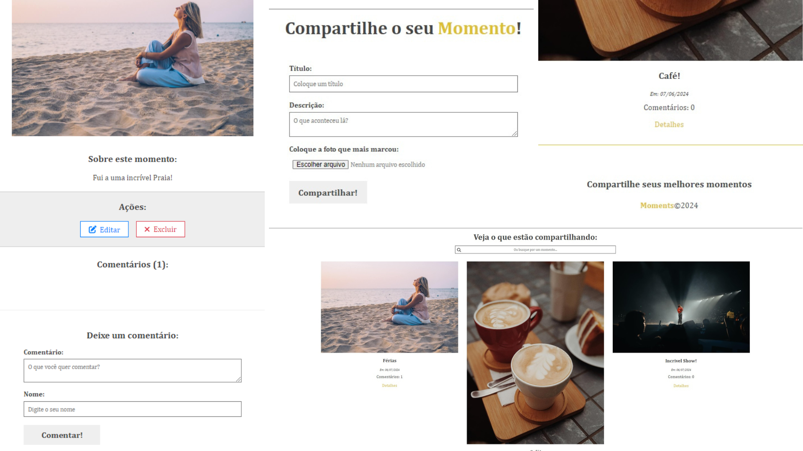

<h1 align="center">
    <p>Compartilhe os seus MOMENTOS!🥂<p/>
</h1>



## Índice

[Sobre](#🚨-sobre)&nbsp;|
[Ferramentas](#🔨-ferramentas)&nbsp;|
[Como Conntribuir](#💻-como-contribuir)&nbsp;|

<!-- [Licença](#📋-licença)&nbsp;| -->

## 🚨 Sobre

O projeto Moments é uma aplicação full-stack desenvolvida com Angular para o frontend e AdonisJS para o backend. A aplicação permite que os usuários compartilhem imagens e textos de momentos especiais através de um formulário, com funcionalidades de criar, ler, atualizar e excluir (CRUD).

As imagens e dados são armazenados em um banco de dados SQLite. A comunicação entre o frontend e o backend é realizada por meio de rotas bem definidas. Este projeto foi desenvolvido para aplicar e demonstrar conhecimentos em Angular, incluindo manipulação de dados em JSON, roteamento, e a construção de componentes de busca e interação com uma [API](https://github.com/lucasnp92/api-moments.git) backend. No backend, utilizamos o AdonisJS para estruturar a API e gerenciar o banco de dados.

Este projeto foi gerado com [Angular CLI](https://github.com/angular/angular-cli) versão 18.0.5.

## 🔨 Ferramentas

- Angular
- TypeScript
- HTML
- CSS
- AdonisJS
- NodeJS
- SQLite

## 💻 Como Contribuir

<h3>FRONTEND</h3>

```bash
    # Clone o projeto
    $ git clone https://github.com/lucasnp92/projeto-moments.git
```

```bash
    # Entre no diretório do projeto
    $ cd projeto-moments
```

```bash
    # Instale as dependencias, se você usa npm
    $ npm install
```

```bash
    # Inicie o servidor do desenvolvimento
    $ npm start
    # ou
    $ ng serve
```

<h3>BACKEND</h3>

```bash
    # Clone o repositório da API
    $ git clone https://github.com/lucasnp92/api-moments.git
```

```bash
    # Entre no diretório da API
    $ cd api-moments
```

```bash
    # Instale as dependências
    $ npm install
```

```bash
    # Configure o banco de dados SQLite. No arquivo .env, verifique se as configurações estão corretas:
DB_CONNECTION=sqlite
DB_DATABASE=./database.sqlite
```

```bash
    # Execute as migrações para criar as tabelas no banco de dados:
    $ node ace migration:run
```

```bash
    # Inicie o servidor AdonisJS:
    $ npm start
    # ou
    $ node ace serve
```

<h3>Créditos</h3>

Este projeto foi desenvolvido com a ajuda do curso do Matheus Battisti do canal [Hora de Codar](https://www.youtube.com/@MatheusBattisti). Agradecimentos especiais ao Matheus Battisti por fornecer excelentes recursos educacionais.

<!-- ## 📋 Licença
Este projeto está sob licença MIT. Veja o arquivo [LICENSE](https://github.com/lucasnp92/) para mais detalhes. -->
